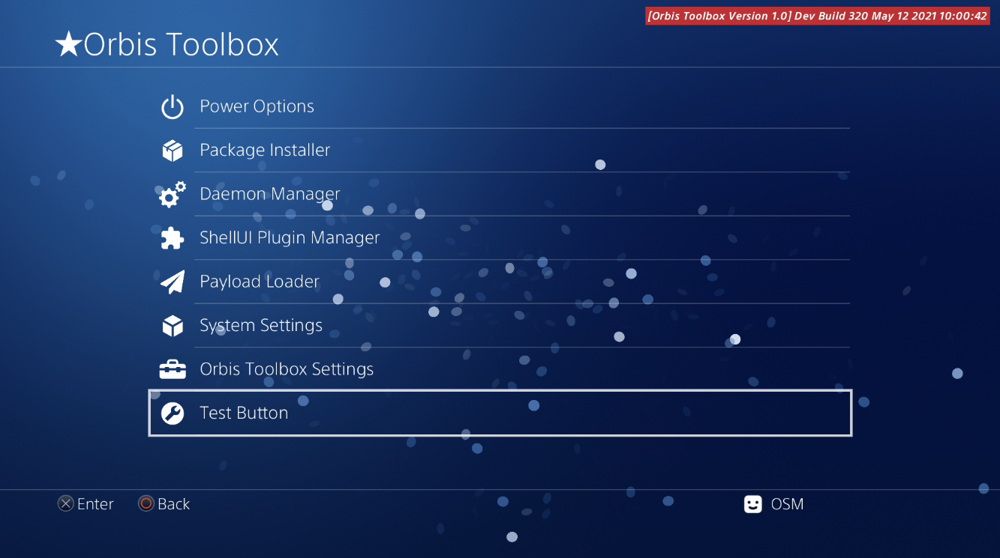

## Introduction
After I had completed the original PS4 Mono write up I already had ambitious goals for my next steps. Little did I know what would come next and how big my project would grow. If you haven’t seen the fruit of that labor you can see a sneak peak [Here](https://www.youtube.com/watch?v=TA22l07jv8w). This write up will be very similar to the last where I will try to tell the story of how I was able to complete the vast majority of my goals and the struggles that came along the way.

There was a few really big ideas that I had a Custom Settings page, Custom Drawing using the Mono C# and running Daemons/Plugins from the UI. I figured these few things could give a boost to a bunch of cool things for home brew developers and increase ease of use for the end users.

## Custom Settings Menu
I knew from my research before that the settings pages were loaded from XML files loaded into memory. So I decided I would try to find where they were used and loaded from. With having the XML files dumped they would help me learn how to format my own XML to craft my own menu.

Quite quickly I realized that the XML files are parsed from the mono executable as an internal asset. This was good for us because we could detour the method that returns a memory stream of the asset and return our custom asset.

### Detours made easy
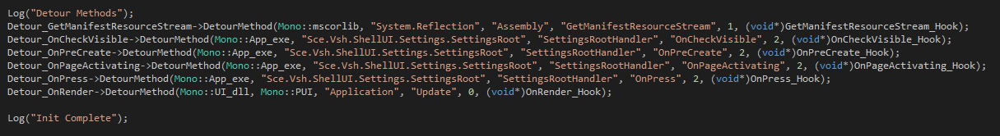

In my original write up I had to manually find the method thunk offsets in order to detour methods. This was time consuming and not really useful in a dynamic sense. A developer (@SiSTRo) in the PlayStation scene gave me the tip that the function ``mono_aot_get_method()`` would return the address to the method thunk.

With this function I was able to stream line my detour class to be able to detour any method with out even needing to use a static disassembler. Well along with the idea I had got from (@kd_tech_) to use the hde64 library to calculate the size of the over written instructions my new detour class was born.

My detour class is open source and can be found [Here](https://github.com/OSM-Made/Orbis-Toolbox/blob/main/Orbis%20Toolbox/Detour.cpp) along with a easy patch installer class found [Here](https://github.com/OSM-Made/Orbis-Toolbox/blob/main/Orbis%20Toolbox/Patcher.cpp). The detour class even features a stub to call the original function with any matter of parameters supported. Do note as well that Mono method thunks the first parameter is always a “this” parameter when the method is part of an non static instance class. With both supporting easy set up and tear down implementing them with safety in mind is easy.

### Loading our Custom XML
Littered around the main executable *(App.exe)* I had found a method ``Push()`` and ``PushWizzard()`` in the class ``UIManager`` this would come in handy later though the function would help us understand how the XML are loaded. The ``UIManager`` class holds an interesting method called ``Parse()`` that takes the XML path as a parameter.

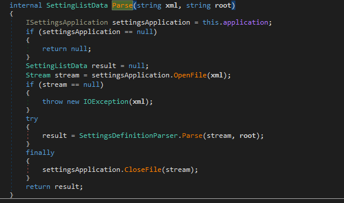

Here is where we find the interesting part that allows us to easily modify the XML files parsed here. ``settingsApplication.OpenFile()`` This method will be calling a part of the C# core library to locate the XML packed into the exe. The library ``mscorelib.dll`` funny enough being developed by Microsoft running on a Sony console holds the method we need ``GetManifestResourceStream()`` found in the class Assembly.

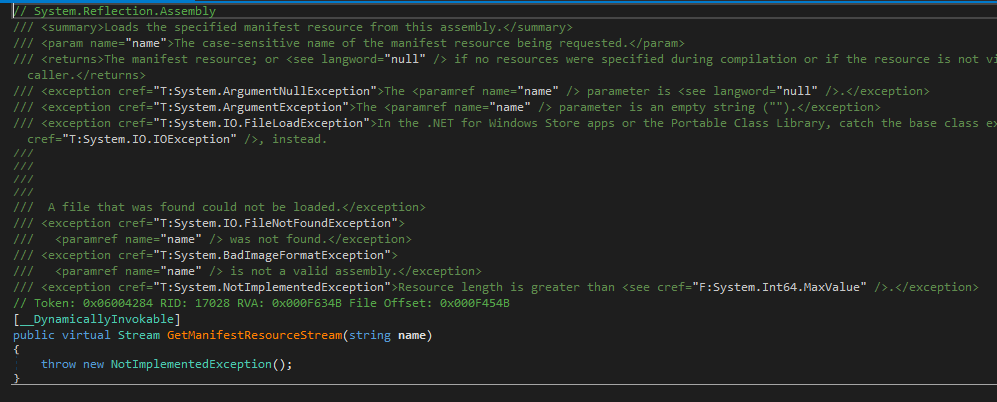

Interestingly enough some where along the line the slashes are converted to ‘.‘ so the path to a resource could look some thing like *“Sce.Vsh.ShellUI.src.Sce.Vsh.ShellUI.Settings.Plugins.orbis_toolbox.xml“*. Definitely a long path but with this we can over write any resource being called upon to replace with our own which I do with the main settings page to add our custom page.

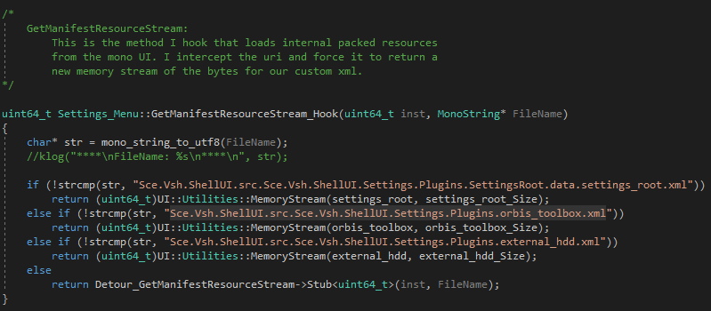

With this Detour complete adding our custom menu to the settings root is as easy as shown below with my custom XML highlighted. As well do note that we can specify images to load from the hard disc using *“file://“* or just a normal URL from the internet.

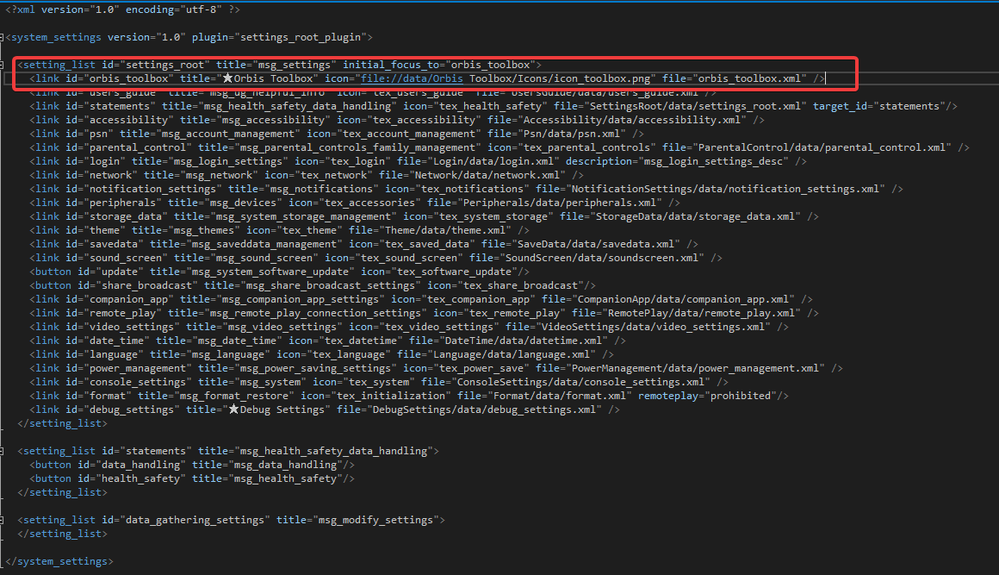


### Functionality
Well now we can have fun adding our own custom menus and items to menus but how can we make them function and be usable? Adding a custom menu plugin to the code would be a lot more involved as each settings page gets its own class that is initialized. Each of these classes or plugins registers a call back that is invoked when each action happens. I have not found a way to do this from the low level embedded mono unfortunately. Though fear not we can just hijack one of these with the call backs we would like to do our bidding.

This is just what I did, I decided to use the settings menu SettingsRoot because it had almost every call back and everything I would need.

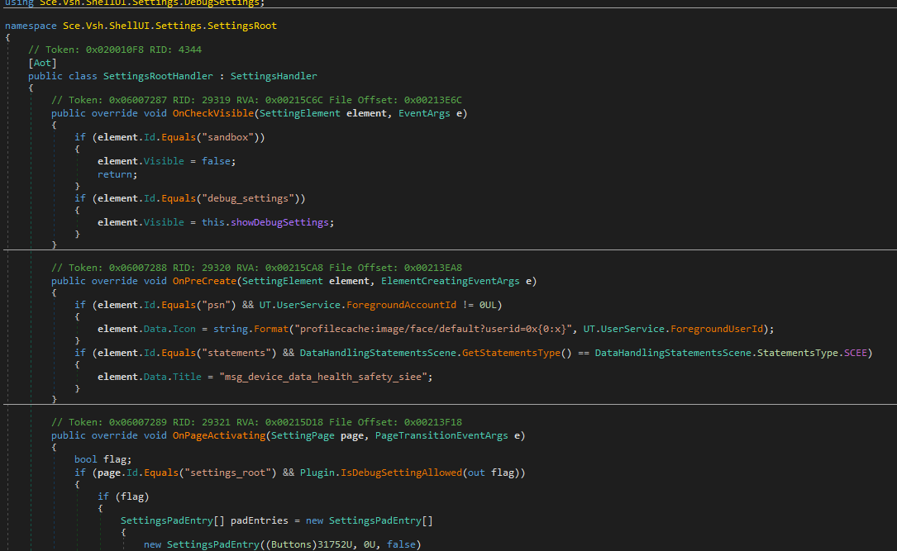

With our new fancy detour class we can make use of all of these methods very easily and quickly. If you would like to see the source code to how I implemented my menu structure using these detours it can be found [here](https://github.com/OSM-Made/Orbis-Toolbox/blob/main/Orbis%20Toolbox/Settings_Menu.cpp) and [here](https://github.com/OSM-Made/Orbis-Toolbox/blob/main/Orbis%20Toolbox/Menu.cpp). My class is intuitively made to make adding and removing options a simple task.

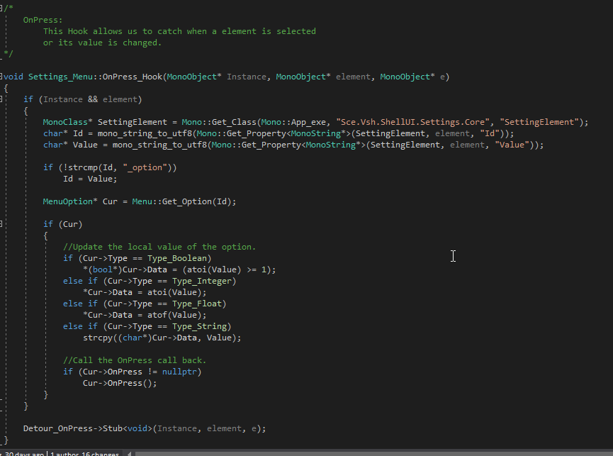

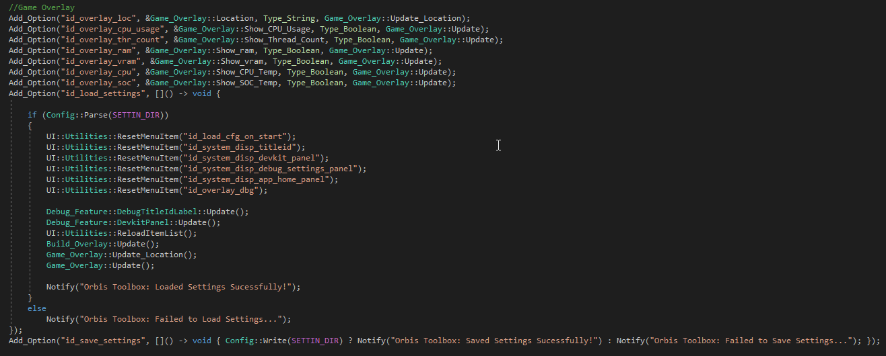

With all this done we now have a custom settings page and it now can function. As well it is fully dynamic and we can add and remove options on the fly. With this huge step it makes interacting with the jail broken console feel more premium.

## Custom Drawing
After completing the custom settings page I set my sights on drawing custom items on screen as I had decided that I wanted to try and work on a custom like quick menu at some point. With the things we learned from the last write up it seemed like an easy task though as we will come to find out a simple mistake and improper documentation would hold things up for a short while.

The class ``AreaManager`` gives us a pretty clear example on how to complete our goal with the method ``createFactoryPanel()``. From this I was able to create a basic test and learn how the drawing works on the PlayStation.

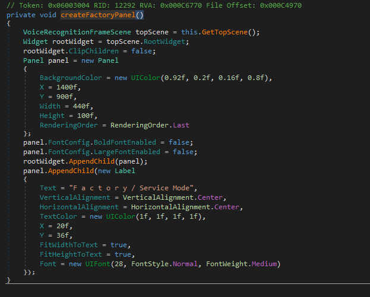

Here we can see a few things of interest. We can see that it is grabbing a scene referenced as the top scene to draw the elements. We can also see that it will create a new instance of each element and add it as a child to the top scene. All of this would be simple to replicate using our c++ mono embedded code or as it would seem easy.

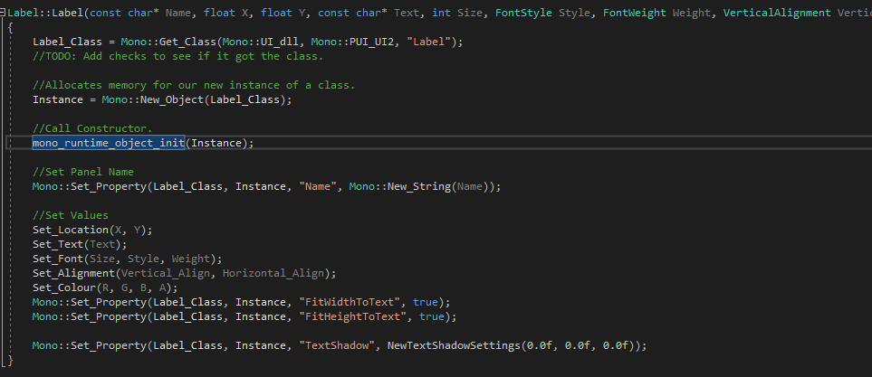

Seems simple enough to implement using the information we learned from before. I have also updated my mono class which is open source and can be found [here](https://github.com/OSM-Made/Orbis-Toolbox/blob/main/Orbis%20Toolbox/Mono.cpp). All seems great right we should be able to draw our custom text right?

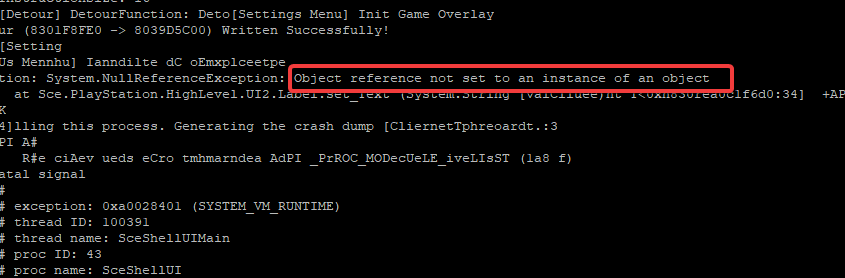

Well not exactly working. Now here is where hopefully I can save you the pain I had to go through to solve this problem. The problem here is actually because of the fact that some things used here are actually ``structs`` not ``classes``. 

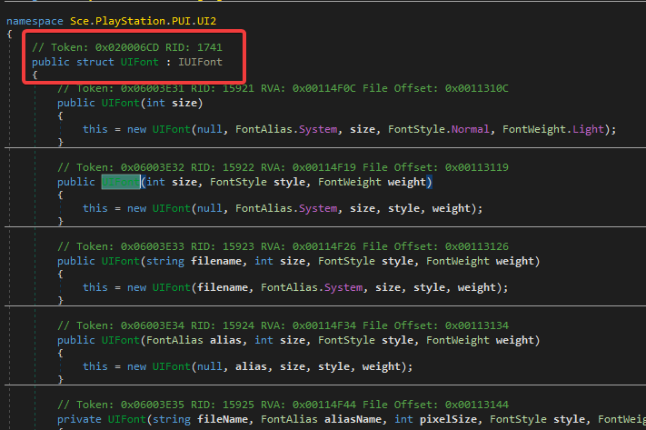

Interestingly enough with mono classes and structures are quite different and it has to do with the fact that structures are treated as a variable in Mono. So because of how Mono treats structures we actually have to unbox the new instance object we create for the structure before invoking the initialization method.

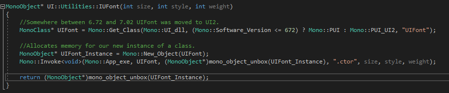

With this problem solved we now have successfully gotten custom drawing working!

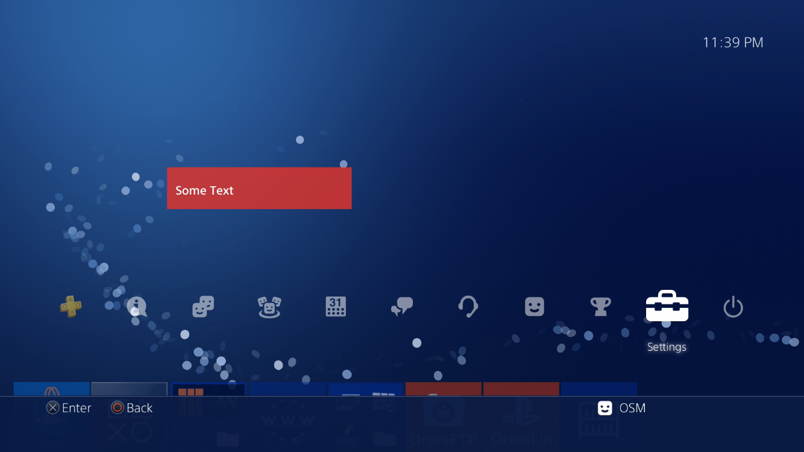

## Scenes
Now the next thing I noticed was the scene that the elements are drawn on is only visible when on the main menu. So I decided I wanted to look into how the scenes are made and which scenes were available for me to use.

The class LayerManager holds the scenes that are used by the user interface and allows us to grab which ever scene we wish to draw on to.


We can use the method ``FindContainerSceneByPath`` to find the game scene we would like by name and using the method above gives us the names of the scenes we would like to be able to use.

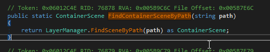

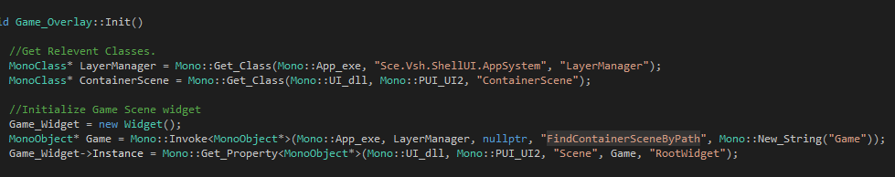

Similar to before with our test we can see here how I am able to use that method to grab to the game scene to draw an overlay for our games.

### Game Overlay
Now with this I had the idea to create an overlay for games to show some interesting and useful information about the console. This would be quite simple to do and you can see my implementation [here](https://github.com/OSM-Made/Orbis-Toolbox/blob/main/Orbis%20Toolbox/Game_Overlay.cpp). Though getting some of the information was not as simple as one would think. With the operating system of the PlayStation being such a heavily modified version of the FreeBSD Linux flavour a lot of what I would like to draw would have to be reverse engineered.

### CPU Usage
I wanted to display the CPU Usage as a game overlay and I had noticed through the UART log that the system would periodically display the CPU Usage and Memory usage statistics. 

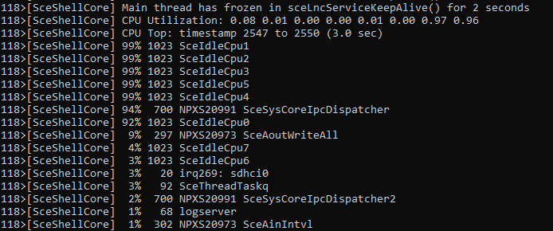

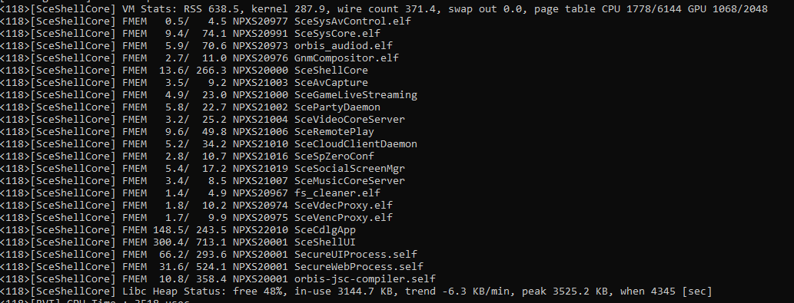

Seems simple enough, I would just need to find which function was printing this information and reverse engineer it to work in our own code and from the print we already know the process was ``SceShellCore``. One would think that for ease of use there would be a function that can be called to return this information.


#### Calculating CPU Usage
I had done a bit of research into how CPU Usage is actually calculated and as it would turn out the usage is calculated based on how much time the CPU spends idling and being used. This would also apply to the Sony method for calculating usage though just in a bit different way. 

In the photo above we can see that on the stack the floating point data for each cores percentage of usage is stored. We can see in the photo below the this function which I have labeled ``calc_cpu_usage()`` is the one that is actually calculating the usage.

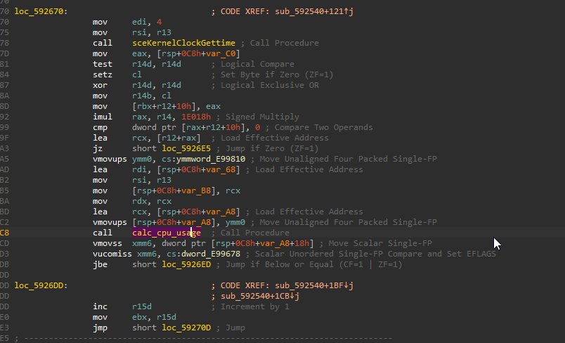

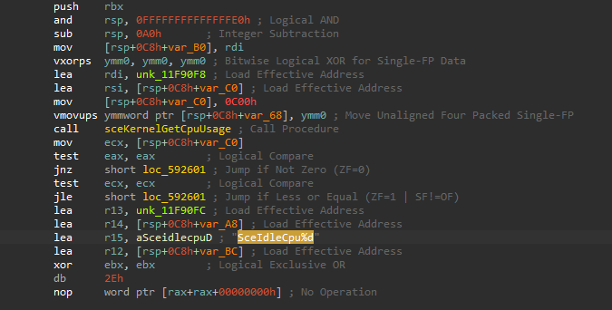

This is where things get interesting so the function named ``sceKernelGetCpuUsage()`` is a bit miss leading as it does not actually return the CPU usage but what it does return is information about each thread being worked on by the CPU. Naturally this information on its own isn’t super useful but as you can see above ``SceIdleCpu%d`` there is a thread that tells us each cores time it spends idling!!

```c++
struct Proc_Stats
{
	int lo_data;                                //0x00
	unsigned int td_tid;                        //0x04
	OrbisKernelTimespec user_cpu_usage_time;    //0x08
	OrbisKernelTimespec system_cpu_usage_time;  //0x18
}; //0x28

int sceKernelGetThreadName(unsigned int id, char* out);
int sceKernelGetCpuUsage(Proc_Stats* out, int* size);
```

As seen above this is the parameters of the CPU usage function and the data that is returned about each thread. 

Basically the Sony function will grab the thread ID for each idle thread and store these for use later. Then after a short period of time it will run the ``sceKernelGetCpuUsage()`` function again to update the statistics. It will store two sets of thread statistics swapping back and forth to use as comparison, You can see my reverse engineered simplified example below.

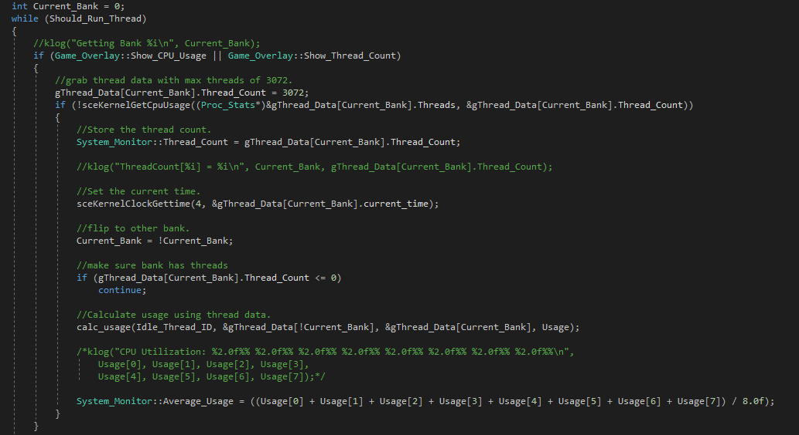

The ``calc_cpu_usage()`` function will take a structure of a few key data points for use when calculating the usage which can be seen below.

```c++
struct thread_usages
{
    OrbisKernelTimespec current_time;   //0x00
    int Thread_Count;                   //0x10
    char padding0[0x4];                 //0x14
    Proc_Stats Threads[3072];           //0x18
};
```

Now with this information we can call the function our selves to calculate the CPU usage though we need to be able to use this information in SceShellUI not SceShellCore. This means we will have to tackle understanding the ``calc_cpu_usage()`` function and reverse engineering it to include in our code. 

The function its self is simple enough to understand doing a few checks on each bank of stats to decide which thread to compare to the other and some more complicated floating point instructions.

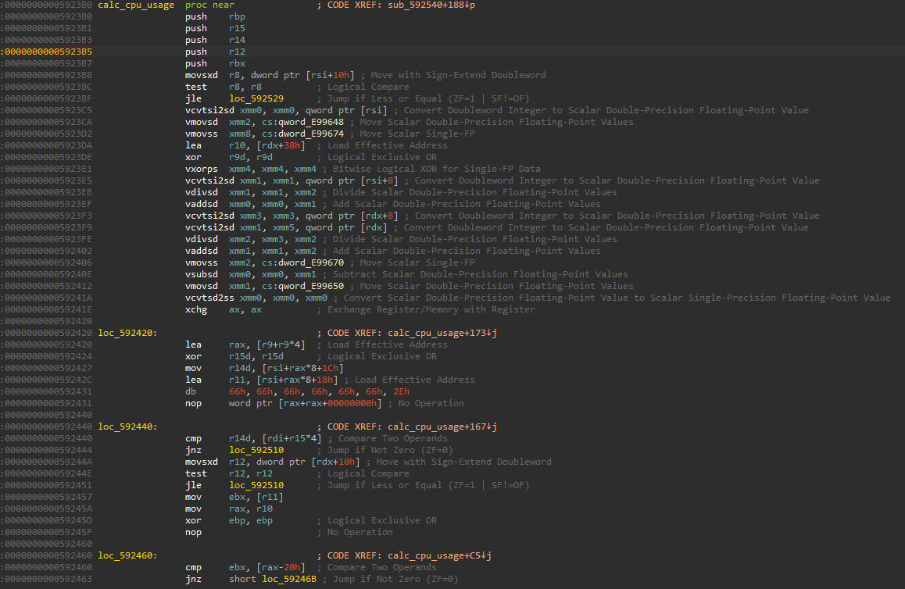

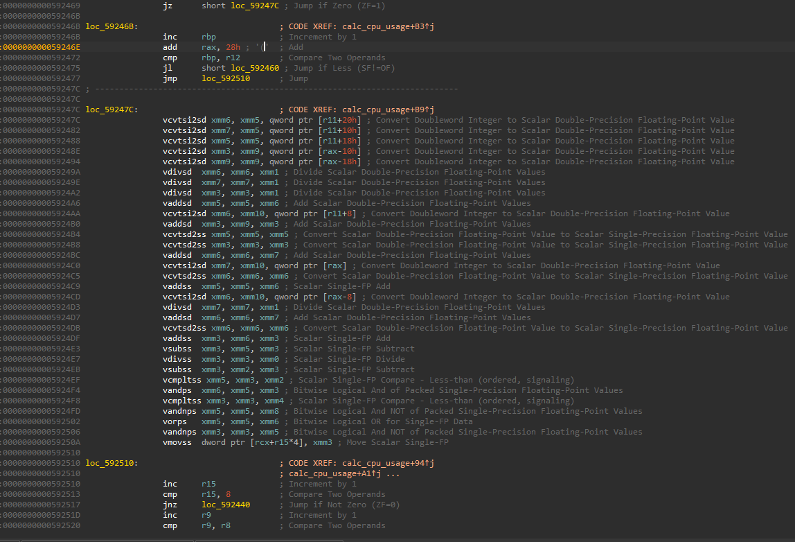

Now this was a more difficult task than I had originally thought. I have a lot of experience with the PowerPC architecture and I am working on learning x86 everyday. Though as it would seem my past experience does actually apply and the documentation for x86 would make learning these more difficult vector instructions quite easy.

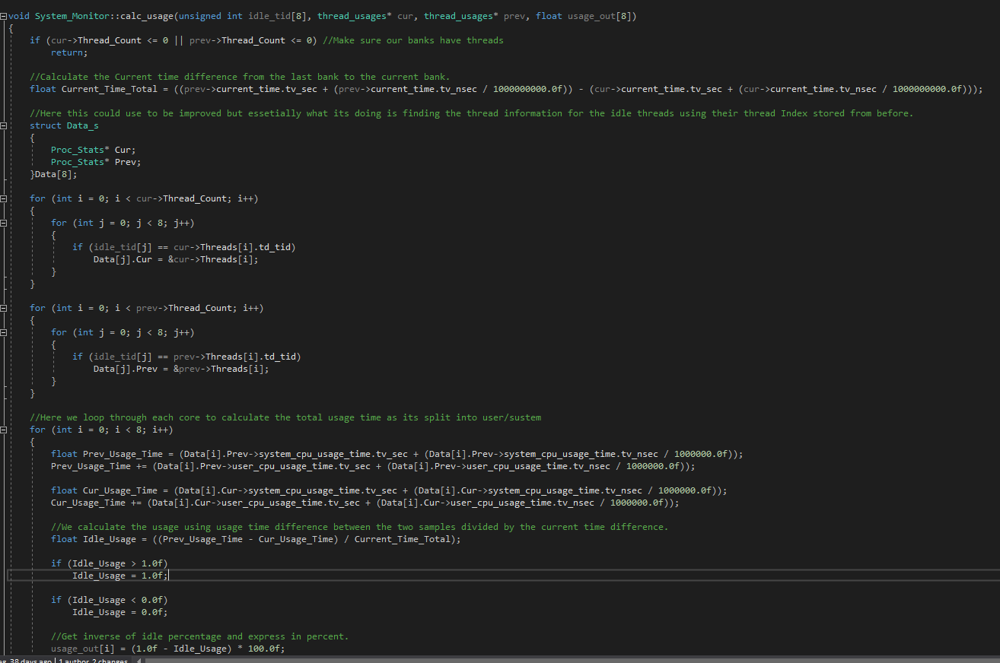

The source code to this can be found [Here](https://github.com/OSM-Made/Orbis-Toolbox/blob/5ab8e80a378ab851a153359604bc7b15d025a9e6/Orbis%20Toolbox/System_Monitor.cpp#L17).

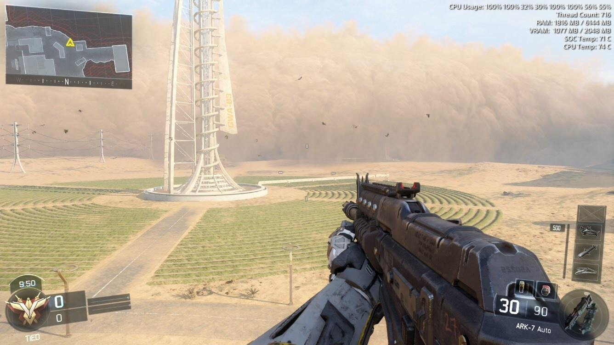

## Daemons & Plugins
So I wanted to be able to start new background processes and load plugins into the UI. I had done a daemon previously with my [Orbis FTP](https://github.com/OSM-Made/OrbisFTP) though now I wanted to be able to custom manage these processes rather than the hacky way I had done before.

I was able to find some info searching thought the app.exe where I found a Utility class where it used another class called ``LncUtil`` which has a method called ``LaunchApp()``. This was perfect I wanted to try it and see if I could get it to launch an app.

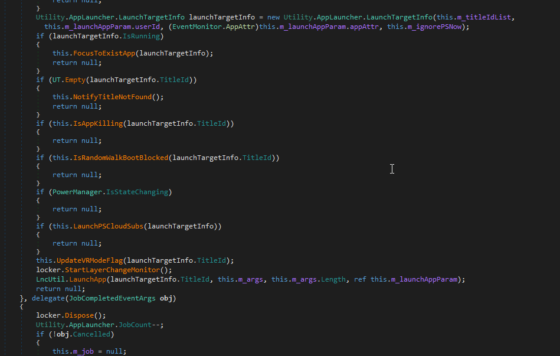

With this I found a lot of useful methods that could be used from here as well. 

- ``LaunchApp()``
- ``GetAppId()``
- ``SuspendApp()``
- ``ResumeApp()``
- ``SetControllerFocus()``
- ``SetAppFocus()``
- ``GetAppStatus()``
- ``KillApp()``
- ``SystemShutdown()``
- ``SystemReboot()``
- ``SystemSuspend()``

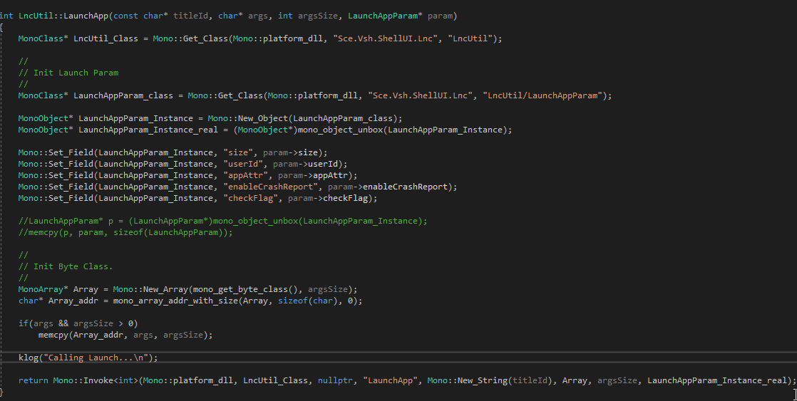

This was my implementation though it is not feature complete it worked for what I needed at the time. The source for this can be found [here](https://github.com/OSM-Made/Orbis-Toolbox/blob/main/Orbis%20Toolbox/LncUtil.cpp#L36). 

```c++
bool Start_Daemon(char* TitleId)
{
	if (!Is_Daemon_Running(TitleId))
	{
		LncUtil::LaunchAppParam p = { sizeof(LncUtil::LaunchAppParam), -1, 0, 0, LncUtil::Flag_None };
		LncUtil::LaunchApp(TitleId, 0, 0, &p);

		if (!Is_Daemon_Running(TitleId))
			return false;
	}

	return true;
}

bool Stop_Daemon(char* TitleId)
{
	int AppId = LncUtil::GetAppId(TitleId);
	if (AppId > 0)
	{
		LncUtil::KillApp(AppId);

		if (Is_Daemon_Running(TitleId))
			return false;
	}

	return true;
}

bool Is_Daemon_Running(char* TitleId)
{
	return (LncUtil::GetAppId(TitleId) > 0);
}
```

Above you can see my implementation of the LncUtil methods to control the Daemons. Launching and starting the Daemon was quite easy not really needing anything special. Though to see if an App was running I found that if you called the method GetAppId() it would return a non negative number if the App is currently running.

### Plugins
Launching an *SPRX(Sony DLL)* as a plugin to the UI is very simple and can be done with the *Libkernel* functions ``sceKernelLoadStartModule()`` and ``sceKernelStopUnloadModule()``. 

## Orbis Toolbox
<iframe width="560" height="315" src="https://www.youtube.com/embed/TA22l07jv8w?si=k51qi72ykUydNvy_" title="YouTube video player" frameborder="0" allow="accelerometer; autoplay; clipboard-write; encrypted-media; gyroscope; picture-in-picture; web-share" referrerpolicy="strict-origin-when-cross-origin" allowfullscreen></iframe>

Through out my journey of learning stuff I had this unnamed project that I was using to test things and after a while decided to give it a name and release it open source [(found here)](https://github.com/OSM-Made/Orbis-Toolbox). The amount of community support I have received is much welcomed and I hope to be able to keep maintaining this project so it can be more and more of use to others.

I never thought going into this project I would have reached this point but over the past few weeks I have been motivated to make huge strides in advancing my career and projects like this help me show off what I have learned. 

## Conclusion
We were able to complete a ton of new things and learn a lot about Mono along the way. With the big hurtles that I had dreamed of under my belt I don’t have too much more to go with this project. I would like to just take the time to refine the project making it better and more feature complete for the end user. As always my projects are open source and you can take a look at it [here](https://github.com/OSM-Made/Orbis-Toolbox).

I hope to continue to learn and grow as a Software Developer and Reverse Engineer. I am happy to share these things with all of you wonderful people of the internet and I hope to inspire others. I hope that with every post I am able to complete I can help others learn something new as I am constantly learning in this industry.