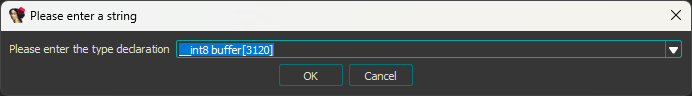

For years PS4 homebrew was using the rigid notify API’s exposed by Sony which didn’t allow for cool things like a custom icon. Something that kept nagging at me was the Spotify app since it had the unique ability to show the title of the song and the album art in the notify pop up. How was a third-party application able to feed a custom image to this highly restricted system? I failed to find this feature inside the Spotify application itself. This wasn't a feature exposed by Sony's public APIs.

**The black box was now my target.**

## libSceSysUtil.sprx
`libSceSysUtil.sprx` would be my first target after failing to find anything useful from the spotify binaries. This library is interesting beacuse at the time the current method for doing the notification popups use a function from the library `sceSysUtilSendSystemNotificationWithText()`.

Calling this method like the following does give you a notifcation popup but you get an icon with a soccer ball.

```c++
sceSysUtilSendSystemNotificationWithText(222, "Hello World");
```


### Inspecting sceSysUtilSendSystemNotificationWithText
If we take a look at the function `sceSysUtilSendSystemNotificationWithText()` in our favourite dissasembler we can see that it is very basic. 

```c++
int sceSysUtilSendSystemNotificationWithText(int messageId, const char* message)
{
  char buffer[3120];

  *(_DWORD *)buffer = 5;
  *(_DWORD *)&buffer[12] = messageId;
  *(_DWORD *)&buffer[40] = 0;
  buffer[44] = 0;
  *(_DWORD *)&buffer[16] = -1;
  if ( message )
    strncpy_s(&buffer[45], 180, message, 179);
  else
    buffer[45] = 0;
  return sceKernelSendNotificationRequest(0, buffer, 3120, 0);
}

```

The function is filling out some data structure which we can assume has the size of `3120` then passing that into `sceKernelSendNotificationRequest()`. 

// TODO: explain the msgid system.

:::tip
Setting the *lvar type* to a byte array in IDA will make it easier to reverse engineer the unknown type from the stack.



:::