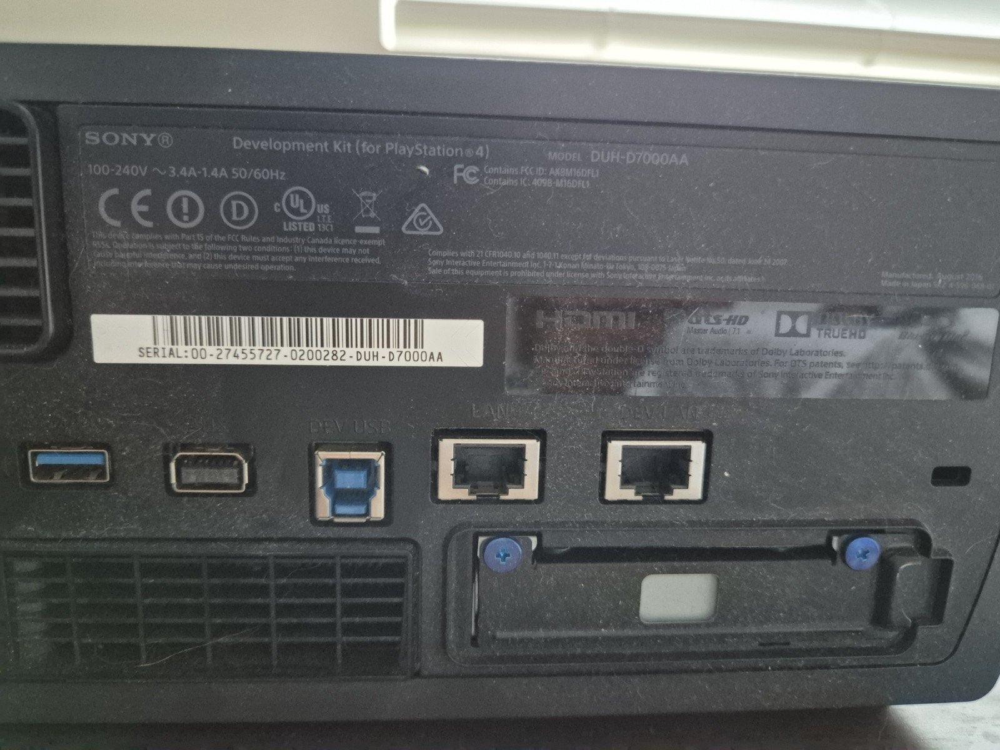

## What Is the DECI Daemon?
Now that we've explored the debugging infrastructure, it's time to look at the other half of the equation: the **DECI Daemon**. DECI is the bridge between the PS4 and Sony’s debugging tools, it handles all communication with the host machine over a network connection (Though also possible through a USB device.) and powers tools like **Neighborhood** and **Sony’s debugger**.

The DECI Daemon acts as a remote control layer for developers, enabling critical functionality like process control, console output, screenshots, remote control and even system software updates. Its capabilities vary based on the current **System Mode**:

- **Release Mode (Retail)**: Not Loaded, simulates final consumer hardware; DECI is present but not loaded.
- **Development Mode**: Fully enabled, supports complete debugging and inspection features.
- **Assist Mode**: A hybrid for profiling purposes; allows limited introspection but blocks direct debugging access.

This mode configuration is enforced through software checks where the mode can be changed in the Debug Settings and applied after a reboot.

Understanding how the DECI Daemon fits into the broader debug stack is essential for any attempt to restore or repurpose Sony’s official tooling, especially on Retail hardware.

## Tracing How the DECI Daemon Loads
With a general understanding of DECI’s role and modes, I wanted to identify exactly how the system loads the DECI Daemon on a DevKit/TestKit and more importantly, how that differs on Retail units.

My go to approach for something like this is static analysis. Since I already know the boot order on PS4 roughly follows:

> Kernel → Syscore Mini → Syscore → Shellcore

I could see in [these boot logs](https://www.psdevwiki.com/ps4/Bootprocess) the PID for **DECI Daemon** was +1 of the **SceShellCore** PID.

```
<118>[SceShellCore] PID 0x24 FMEM  17.1/ 144.3 SceShellCore
<118>[SceShellCore] PID 0x25 FMEM  12.5/  95.3 decid.elf
```

In addition to this I could see that some DECI start up logs would appear after **SceShellCore** started and after **SceSysCore** started. With this info it is reasonable to believe that either **SceShellCore** or **SceSysCore** is responsible for loading the **DECI Daemon**.

### Finding the Launch Point
I started with a basic string search for “DECI” in the Retail versions of these binaries and I would quickly find some strings that quickly revealed an interesting path:


That file is the **DECI Daemon binary**, and as expected, it doesn’t exist on Retail systems, it's stripped from the filesystem. However, sourcing it for analysis wasn’t difficult given the extensive amount of leaked development SDK’s and hardware. 


Using cross references on that string, I landed on the following function:

```c
int SpawnDecidProcess()
{
  /* ... */
  
  v3 = SpawnProcess(&decidProcessId, "/system/sys/decid.elf", &off_D41C0, &v5, 5);
  if ( v3 )
    printf("[UMD MAIN] Lauching decid.elf failed. ret=%#x\n", v3);
  else
    printf("[UMD MAIN] launching decid.elf PID=%#x\n", decidProcessId);
  StoreDecidPid(decidProcessId);
  return 0;
}
```

This function tells us everything we need to know:

- DECI is expected at ``/system/sys/decid.elf``
- It's spawned like any other system process
- Logging confirms both success and failure states

The binary may be gone on Retail systems, but the launch logic is still there.

### Who Calls SpawnDecidProcess?
If I follow the cross references up from this method we arrive at an entry point for a thread. This shows us that this thread is spawned early in **SceSysCore**’s start up procedure just after **SceShellCore** is spawned.

```c
int DevPortThread(void* args)
{
  /* .. */
  
  ConnectToCPBox();
  
  /* ... */
  /* Sets up the network & Gets the link mode for DEVIP */
  
  if ( !LinkMode && (args == 0 || IsDevKit != 0) && sub_3160(IsTestKit) )
    sub_26D0(IsTestKit);
  
  mdbgSetup();
  if ( IsDevKit || ((sceKernelIsAssistMode() == 0) & ~LinkMode) == 0 )
    SpawnDecidProcess();
  
  if ( (LinkMode & (args == 0 || IsDevKit != 0)) == 1 && sub_3160(IsTestKit) )
    sub_26D0(IsTestKit);
  
  v7 = sceNetDuplicateIpStart(3, (__int64)sub_1640, 0LL, 0x4000, 700);
  if ( v7 )
    printf("[SceSysCore] sceNetDuplicateIpStart failed %x\n", v7);
  
  return 0;
}
```

This is the thread entry for ``"SceSysCore:DevPort"``, It's responsible for checking what kind of system we’re on (DevKit, TestKit, Retail) and conditionally launching DECI based on that. This thread is responsible for a few other things like connecting to the **DEVUSB** or setting and checking the networking environment for the **DEVLAN**.

This confirms:
- **Retail consoles** do not pass the checks to launch ``decid.elf``
- The logic is still baked into the system even when unused.
- Launch and environment checks are happening in the **SceSyscore** layer.

## Patching SceSysCore: Manually Spawning decid.elf
With the ``SpawnDecidProcess()`` function mapped out, my next thought was:

> What if I could just ignore the logic in DevPortThread, copy the decid.elf from the DevKit and trigger the launch myself?

I figured that if I would just hook the calls to ``sceKernelCheckDipsw()``, ``sceKernelIsDevKit()``, ``sceKernelIsTestKit()``, ``sceKernelIsAssistMode()``, ``sceKernelIsGenuineN()`` to replicate the environment that will ensure the **DECI Daemon** get launched. I could then just spin up a thread and point it at the entry point in SceSysCore for ``"SceSysCore:DevPort"`` which should spawn the **DECI Daemon** process.

## First Roadblock: Decryption Failure
This would be successful in getting ***SceSysCore*** to attempt to launch the **DECI Daemon** process but it would fail with the following error…

```
ERROR: _sceSblAuthMgrSmIsLoadable2(1368) mail retval err -2146497233
ERROR: sceSblAuthMgrIsLoadable(519) Invokecheck err(800f0d2f): 3800000000000007, 3800000000010003
[UMD MAIN] Lauching decid.elf failed. ret=0x8
```

Retail systems can’t decrypt the ``decid.elf`` binary. It’s not exactly clear to me why just this binary the system will refuse to decrypt it but the code ensuring this appeared to be within ***SAMU***. This was an unexpected outcome since my Retail Console could decrypt other Devkit/Testkit binaries.


This was fairly trivial to overcome using the same flow that other researchers have done using a Devkit as the oracle and signing it like any other home brew. It is worth noting it must be given the system flag to run correctly.

With that in place, **SceSysCore** would be successful in launching the DECI Daemon process

...Or so I thought.

## Second Roadblock: Missing libraries
Despite launching, ``decid.elf`` exited with the following error:

```
ulpmgr.c : fail to load /system/priv/lib/libulpcommon.sprx
```

This should be a simple fix as this is just a library missing from the retail system, So I took the time to take note and copy over every library that is not present on the Retail from a Devkit filesystem dump.

I would add all of the libraries not present on a retail console from ``/system/priv/lib/`` as well I would add some config files from ``/system/priv/settings/``. I wasn’t sure if all of these were needed but I figured it would help to ensure they are present on my retail in the event they are important. 

## Third Roadblock: Internal Environment Checks
After adding the missing files from the dev environments **DECI Daemon** would exit with the following new error:

```
[UMD MAIN] launching decid.elf PID=0x49
<73> EXEC /system/sys/decid.elf [system], vm#0, dmem#0  <1955638 msec>
decid can't run in this environment!
```

I had side stepped the checks in **Syscore** and I figured this may come back to bite us, if we dig into the code the ``decid.elf`` runs at start up we find the following environment checks:

```c
if (!sceKernelIsCEX()
	&& (!sceKernelIsTestKit() && !sceKernelCheckDipsw(1LL)
	|| sceKernelIsDevelopmentMode() || sceKernelIsAssistMode())
	&& (!sceKernelIsTestKit() && !sceKernelCheckDipsw(1LL)
	|| !sceKernelIsDevelopmentMode()))
{
	// Launch deci
}

puts("decid can't run in this environment!");
return 0;
```

Wow! There is a lot to unpack here lets break down the code a bit to make some better sense of it…

```c
auto isCex = sceKernelIsCEX();
auto check1 = (!sceKernelIsTestKit() && !sceKernelCheckDipsw(1LL) || sceKernelIsDevelopmentMode() || sceKernelIsAssistMode());
auto check2 = (!sceKernelIsTestKit() && !sceKernelCheckDipsw(1LL) || !sceKernelIsDevelopmentMode());

if (!isCex && check1 && check2)
{
  // Launch deci
}

puts("decid can't run in this environment!");
return 0;
```

This is a bit better! In order for DECI to believe its in the correct environment we need the following to be true:

- Our console is not a **CEX** (Retail).
- Our Console is not a **Testkit** AND Dip switch 1 is *off*, OR **Development Mode** is *Enabled*, OR **Assist Mode** is *Enabled*.
- Our Console is not a **Testkit** AND Dip switch 1 is *off*, OR **Development Mode** is *Disabled*.

This is easier to explain if we jump a bit ahead in the story and have the knowledge that Dip Switch 1 is actually **Disable DEVLAN**. This makes this environment check make sense because only **DevKits** can disable their **DEVLAN** because **Testkits** do not have a **DEVLAN** port. 

So what it should read like is the following:

- Our console is not a **CEX** (Retail).
- Our Console is not a **Testkit** AND **DEVLAN** is *Enabled*, OR Development Mode is *Enabled*, OR Assist Mode is *Enabled*.
- Our Console is not a **Testkit** AND **DEVLAN** is *Enabled*, OR Development Mode is *Disabled*.

This all will be important for the next road block… For now we will just patch the branch in ``decid.elf`` so that we skip these checks.

At this point I was hoping at very least to get an error but I waited and nothing would happen… ``decid.elf`` was just hung… So we must dig deeper into the the start up code to figure out where the hang is occurring.

## Fourth Roadblock: DEVLAN
Solving this issue would be easier if we knew exactly where ``decid.elf`` was hung using a debugger but I had to figure this out the hard way. I decided to use my strong **static analysis** skills to manually walk the startup logic in search of a method that may block execution and I found just that!

```c
/* ... */

v21 = fB6YPEgMPtk_A_B(0LL);

v22 = 8556;
if ( !pGeVj8ujCiA_A_B() )
  v22 = 8550;
  
if ( v21 != -1 && (int)sub_3500(v21, v22, a1) < 0 )
{
  fwrite("[DECI] ", 7, 1, Stdout);
  fwrite("[WARNING] Could not setup DEVLAN\n", 33, 1, Stdout);
}

if (pGeVj8ujCiA_A_B() && (int)sub_3DC0() < 0 )
{
  fwrite("[DECI] ", 7, 1, Stdout);
  fwrite("[WARNING] Could not setup DEVUSB\n", 33, 1, Stdout);
}

/* ... */

printf("Deci Daemon has been set up. Please connect to ");
if ( v21 == -1 )
  puts("DEVUSB");
else
  printf("%d port\n", v22);
```

This code seems to be where ``decid.elf`` is sorting out which communication method is selected then it will hang here until that method is online. The options available would be one of following **DEVLAN**, **DEVUSB** or **ETH0**. These options would make sense since **Devkits** have the ability to use the **DEVLAN** or **DEVUSB** but TestKits only have the **ETH0** available to them. So we need to dig into these import calls to figure out how to force *DECI* to use our **ETH0** for its communications.



That search brings us to the method ``fB6YPEgMPtk_A_B`` this method (which is named by its raw **NID** since we do not know its proper symbol name) is imported from the library ``libulpcommon.srpx``.

```c++
int fB6YPEgMPtk_A_B(int numTries)
{
	SceNetIfEntry ifEntry;
	char linkMode[4];
	int triesLeft = numTries - 1;

	// DEVUSB
	if (sceKernelIsGenuineDevKit() == 1
		&& sceKernelGetMainSocId() >= 0x740F00
		&& sceKernelGetMainSocId() <= 0x740F7F
		&& !sceKernelCheckDipsw(102))
	{
		if (sceNetGetIfList(SCE_NET_IF_NAME_DBG0, &ifEntry, 1) != 1
			|| (ifEntry.LinkStatus == 1
				&& (sceNetConfigEtherGetLinkMode(SCE_NET_IF_NAME_DBG0, linkMode) || (linkMode[0] & 1) == 0))
			|| !ifEntry.IPAddress)
		{
			if (sceDevUsbIsHostConnected())
				return -1;

			while (sceNetGetIfList(SCE_NET_IF_NAME_DBG0, &ifEntry, 1) != 1
				|| (ifEntry.LinkStatus == 1
					&& (sceNetConfigEtherGetLinkMode(SCE_NET_IF_NAME_DBG0, linkMode) || (linkMode[0] & 1) == 0))
				|| !ifEntry.IPAddress)
			{
				if (!sceDevUsbIsHostConnected())
				{
					sceKernelSleep(5);

					if (numTries > 0 && triesLeft-- == 0)
						return -1;
				}
				else
				{
					return -1;
				}
			}
		}

		return SCE_NET_IF_NAME_DBG0;
	}

	// DEVLAN
	if (!sceKernelIsTestKit() && !sceKernelCheckDipsw(1))
	{
		while (sceNetGetIfList(SCE_NET_IF_NAME_DBG0, &ifEntry, 1) != 1
			|| (ifEntry.LinkStatus == 1
				&& (sceNetConfigEtherGetLinkMode(SCE_NET_IF_NAME_DBG0, linkMode) || (linkMode[0] & 1) == 0))
			|| !*(int*)ifEntry.MacAddress)
		{
			sceKernelSleep(5);

			if (numTries > 0 && triesLeft-- == 0)
				return -1;
		}

		return SCE_NET_IF_NAME_DBG0;
	}

	// ETH0
	while (sceNetGetIfList(SCE_NET_IF_NAME_ETH0, &ifEntry, 1) != 1
		|| (ifEntry.LinkStatus == 1
			&& (sceNetConfigEtherGetLinkMode(SCE_NET_IF_NAME_ETH0, linkMode) || (linkMode[0] & 1) == 0))
		|| !*(int*)ifEntry.MacAddress)
	{
		sceKernelSleep(5);

		if (numTries > 0 && triesLeft-- == 0)
			return -1;
	}

	return SCE_NET_IF_NAME_ETH0;
}
```

We can see the conditions for each of the three scenarios mentioned above. We end up following down the **Devkit** path because we are on a **Retail** console so ``sceKernelIsTestKit()`` returns false and the dip switch(1) for **disable DEVLAN** will be set to false. 

This explains why DECI is hanging, it is in fact waiting for the **DEVLAN** to switch its network state. 

## Dip Switch patches
I decided to take a look at the userland library ``libSceDipsw.sprx`` and I found that each of the methods would use ``/dev/dipsw`` and make **IOCTL** requests. I was most interested in ``sceKernelCheckDipsw()`` since it is used in the check for ``sceKernelIsDevelopmentMode()`` & ``sceKernelIsAssistMode()``.

```c
struct CheckDipSwReq
{
	uint16_t dipIndex;
	char _0x02[0x2];
	uint32_t dipValue;
};

int sceKernelCheckDipsw(uint16_t dipIndex)
{
	if (dipIndex >= 0x100)
		return sceKernelError(EINVAL);

	int fd = open("/dev/dipsw", O_RDWR);
	if (fd < 0)
	{
		/* Some Error handling.. */

		return -1;
	}

	CheckDipSwReq request;
	request.dipIndex = dipIndex;

	if (ioctl(fd, 0xC0088803, &request) < 0)
	{
		/* Some Error handling.. */

		close(fd);
		return -1;
	}

	close(fd);
	return request.dipValue;
}
```

This method is very simple it will pass in the **dipIndex** we want to check then the Kernel will write out to the same struct the **dipValue**. So I came up with a simple hook so we can easily change these **dipValues** on the fly while testing our theories.

By setting dip switch 2 to false it will ensure that ``IsAssistMode()`` is always false and setting dip switch 0 to true it will ensure that ``IsDevelopmentMode()`` will always be true. I also set dip switch 1 to true to disable the **DEVLAN** and I also set ``102`` to true (I speculate this is **Disable DEVUSB** but it is not clear). With these values set in the dip switches the method ``fB6YPEgMPtk_A_B`` should return 1(ETH0) so that DECI will do its communications over the wired ethernet adapter.

I also at this time took the liberty to set our product code to that of a Devkit (``82 02``) and set the flags for enabling **UL/SL debugger** (Userland/System Level debugger). The offsets shown are for the **9.00 Kernel**.

```c
#define addr_QAFlags 0x02216850

// TargetId of Devkit.
*(uint8_t*)(KernelBase + addr_QAFlags + 0x3D) = 0x81;
*(uint8_t*)(KernelBase + addr_QAFlags + 0x3E) = 0x02;
 
// Enable UL/SL debugger
*(uint8_t*)(KernelBase + addr_QAFlags + 0x36) |= 0x4;
*(uint8_t*)(KernelBase + addr_QAFlags + 0x59) |= 0x2;
*(uint8_t*)(KernelBase + addr_QAFlags + 0x59) |= 0x1;
```

## Success!?
Launching DECI again after setting our new patches and hooks in the Kernel and we see the logs we have been hoping for!

```
mDBG: init failed
[UMD MAIN] launching decid.elf P<ID=0x41
mDBG: DA Connected
[DECI] can't open device. errno: 2
Deci Daemon has been set up. Please connect to 8550 port
```

**DECI has launched successfully!!**


There is some errors that are present in the logs but I decided to check if **Neighborhood** can detect and communicate with my console…


## Conclusion
Getting the **DECI Daemon** to run on a Retail console turned out to be a layered but relatively straightforward puzzle. Each obstacle revealed just how deeply DECI is woven into the system, and how all of its supporting logic remains present in the retail binaries. By applying a few targeted patches, I was able to bypass the dormant environment checks and watch the **DECI Daemon** finally launch.

The real breakthrough wasn’t simply seeing DECI start, it was demonstrating that the Retail binaries still contain everything needed to bootstrap it. This confirms that Sony’s debug infrastructure is universal across PS4 hardware, and that the tight coupling of DECI to system components makes it hard to fully disable for production or at the very least a clear choice was made to limit what is removed. 

From a security perspective, this highlights how latent debug capabilities increase the attack surface on consumer hardware. These remaining surfaces could have been minimized or removed entirely. As they exist, a potential attacker with kernel arbitrary R/W could leverage them for post-exploit tasks, such as performing userland patches or moving laterally within userland.

With DECI alive and Neighborhood recognizing the console, this proves that a Retail console can be coerced into DevKit like behavior. While errors and quirks remain, this milestone shows that bridging the Retail/DevKit divide isn’t theoretical, it’s entirely practical and demonstrable.