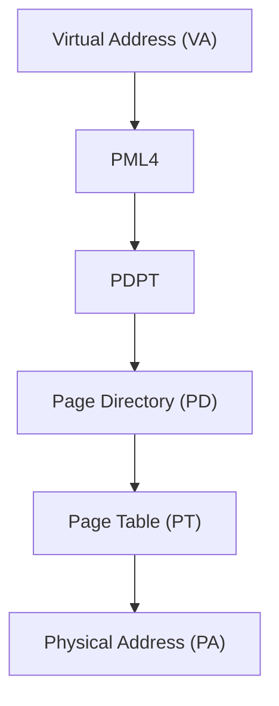
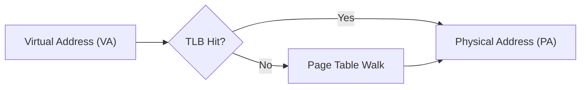
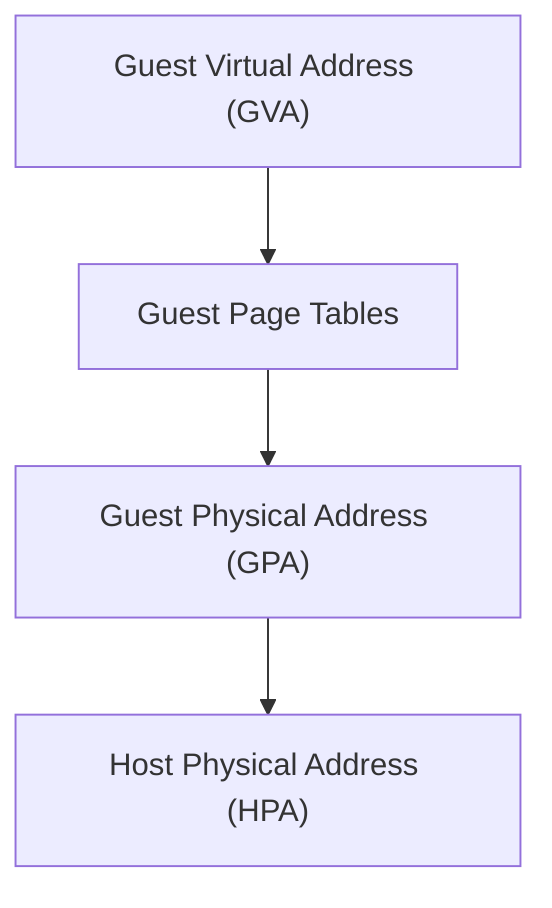
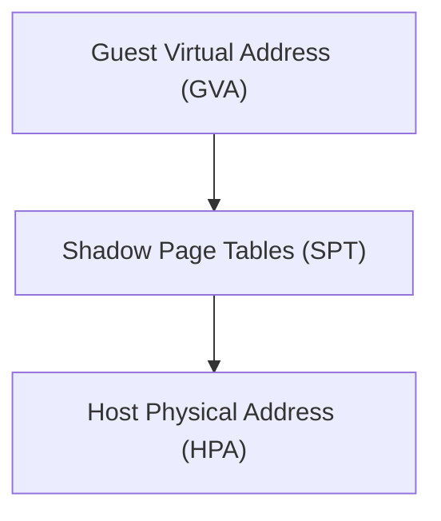
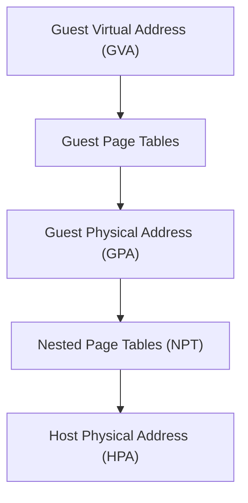

## Introduction
While experimenting with AMD SVM on the PS5, I began noticing some performance degradation related to disabling Nested Page Tables (NPT). At the time, my original goal was simply to better understand the hypervisor environment and experiment with behavior that had been publicly discussed previously. Instead, I ended up stumbling into a much more interesting performance issue involving nested paging and memory translation behavior.

What immediately stood out was that disabling NPT resulted in roughly a 3x performance loss compared to leaving NPT enabled. This ended up sending me down a rabbit hole to better understand how guest-to-host physical address translation operates under AMD SVM and why the fallback behavior without hardware-assisted nested paging appeared substantially more expensive than I originally expected.

This post covers the initial behavior I observed, the methodology I used while measuring it, and the changes that significantly improved the performance. Along the way, I also ended up learning quite a bit about how nested paging and memory translation operate in practice on the PS5. I also want to use this post as an opportunity to explain some of the fundamentals behind AMD SVM paging, how Nested Page Tables differ from Shadow Page Tables, and why hardware-assisted nested translation is typically expected to perform substantially better.

## Nested Paging Background

### Traditional x86 Paging

Modern x86_64 systems operate primarily using virtual memory. Rather than applications directly accessing physical memory addresses, the CPU instead works with Virtual Addresses (VA), which must be translated into Physical Addresses (PA) before memory can actually be accessed.

On x86_64 systems, this translation is typically performed using a four-level paging hierarchy each level is used to progressively narrow down the final physical page backing a given virtual address.


The operating system kernel is responsible for managing these paging structures, while the CPU hardware itself performs the page table walks during address translation.

Since repeatedly walking multiple paging levels would be extremely expensive, modern processors also include a Translation Lookaside Buffer (TLB), which acts as a cache for recently translated virtual-to-physical mappings. When a translation already exists in the TLB, the CPU can avoid performing a full page table walk entirely.

### Translation Lookaside Buffer (TLB)

Repeatedly walking multiple levels of paging structures for every memory access would be extremely expensive. To reduce this overhead, modern processors include a hardware-backed cache known as the Translation Lookaside Buffer (TLB).

Rather than performing a full page table walk every time memory is accessed, the processor can cache recently translated virtual-to-physical mappings inside the TLB.



When a translation already exists in the TLB, the processor can avoid walking the paging hierarchy entirely. However, when a translation is not present, the processor must perform a full page table walk to resolve the mapping before continuing execution.

As additional translation layers are introduced through virtualization, the cost of TLB misses and page walks becomes increasingly important.

### Hypervisors and Guest Memory

Virtualization adds an additional layer between the operating system and the underlying hardware. Instead of the guest operating system directly controlling physical memory, a hypervisor sits underneath the guest and is responsible for managing and isolating system resources.

From the guest operating system’s perspective, it still believes it owns and manages physical memory normally. However, the “physical” memory the guest sees is not actually the real system physical memory.

This introduces an additional layer of address translation:



While the guest operating system controls the Guest Virtual Address to Guest Physical Address translation, the hypervisor controls how Guest Physical Addresses map onto the real system physical memory.

### Shadow Page Tables (SPT)

Before hardware-assisted virtualization features such as Nested Page Tables (NPT) were introduced, hypervisors commonly relied on a technique known as Shadow Page Tables (SPT).

Rather than allowing the guest operating system to directly control the page tables used by the processor, the hypervisor instead maintained its own “shadow” copy of the guest’s mappings. These shadow tables represented a merged view of both the guest’s intended memory layout and the hypervisor’s own security restrictions.



This allowed the hypervisor to maintain control over memory access, but it also introduced significant overhead. Since the guest operating system was unaware that shadow paging was being used, the hypervisor often needed to intercept guest page table updates, validate mapping changes, rebuild shadow mappings, and invalidate translations when memory layouts changed.

As guest operating systems became more complex and memory management activity increased, maintaining Shadow Page Tables became increasingly expensive.


### Nested Paging (NPT)

Nested Page Tables (NPT) are AMD’s hardware-assisted memory virtualization feature provided through AMD SVM. Rather than requiring the hypervisor to actively maintain merged shadow mappings on behalf of the guest, the CPU hardware is able to perform both layers of translation directly.

With NPT enabled, address translation becomes a two-stage process:



The guest operating system still manages its own page tables normally and remains unaware that virtualization is occurring underneath it. While the guest controls the Guest Virtual Address to Guest Physical Address translation, the hypervisor still controls how Guest Physical Addresses map onto the real system physical memory through the Nested Page Tables.

```text
Guest Controls:
GVA → GPA

Hypervisor Controls:
GPA → HPA
```

Importantly, the NPT is not a 1:1 mirror of the guest page tables. The hypervisor generally does not care how the guest organizes its virtual memory layout internally. Instead, the hypervisor primarily cares about controlling and protecting Guest Physical Address ranges and how they map onto real system memory.

This significantly reduces the overhead traditionally associated with Shadow Page Tables (SPT), where the hypervisor is forced to actively maintain synchronized shadow mappings as the guest updates its own paging structures.

Of course, the additional translation layer introduced by NPT is not free. In the event of TLB misses or page walks, the processor may now need to resolve both guest-managed and hypervisor-managed paging structures, increasing the amount of work required to translate a memory access successfully.

## Initial Observation / Testing Methodology