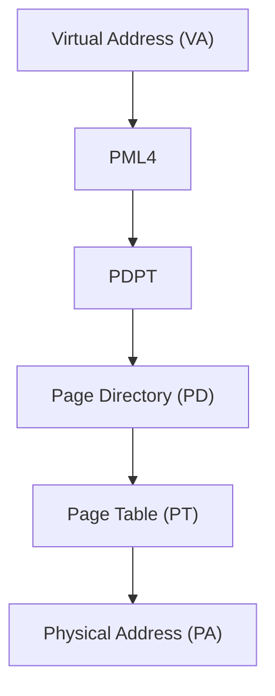
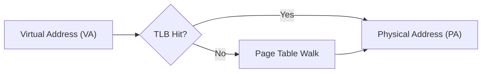
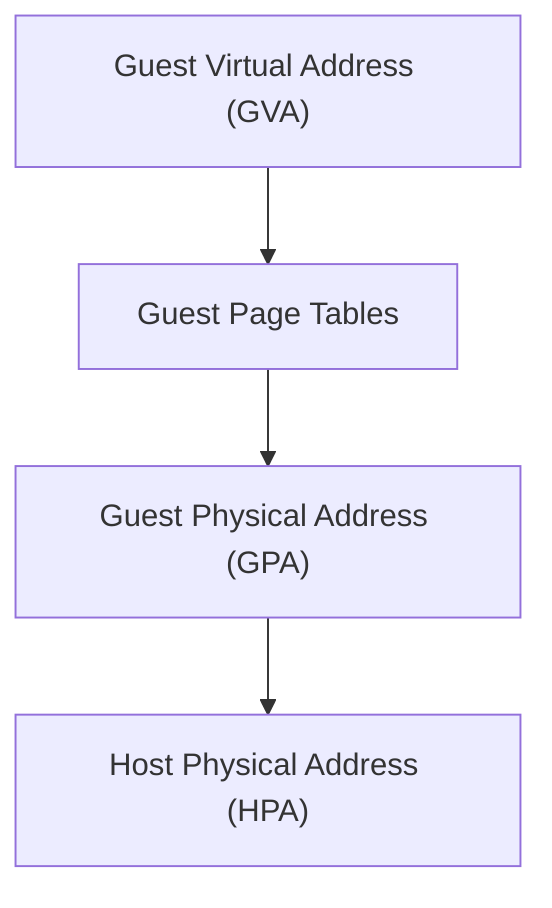
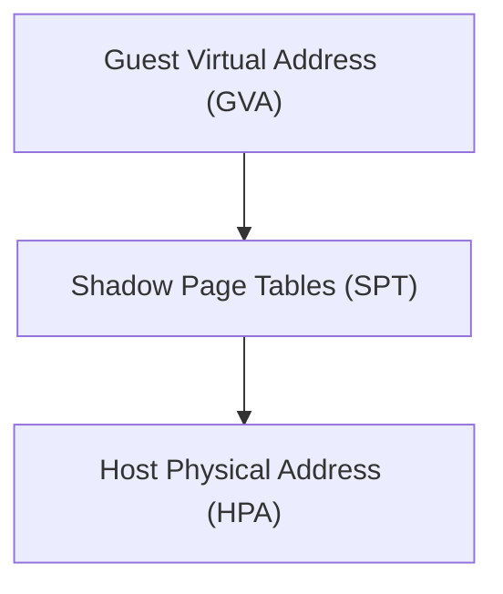
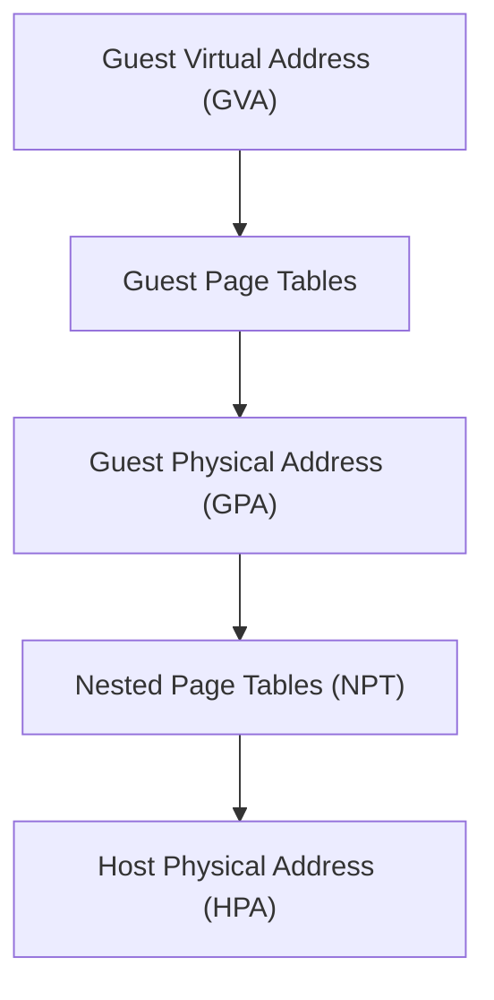
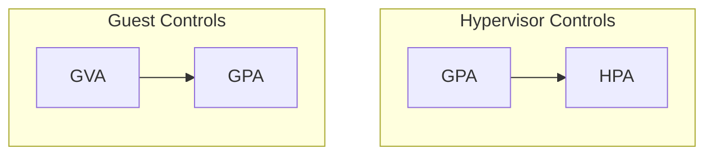
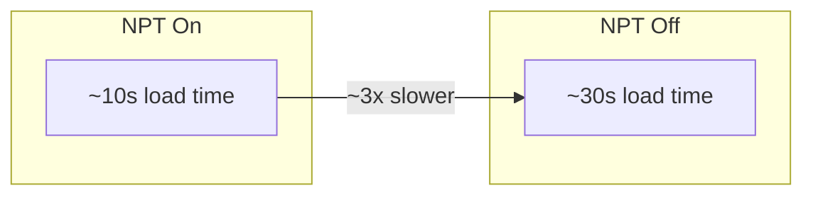
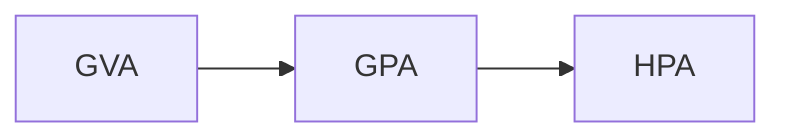
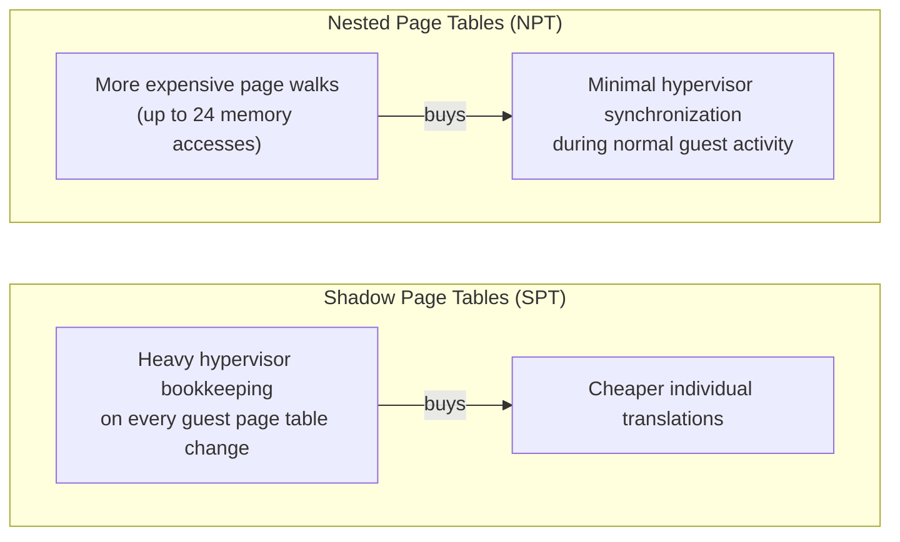

import nptOn from './NPT-ON.mp4'
import nptOff from './NPT-OFF.mp4'

## Introduction
While experimenting with AMD SVM (Secure Virtual Machine) on the PS5, I noticed significant performance degradation when Nested Page Tables (NPT) were disabled. At the time, my original goal was simply to better understand the hypervisor environment and experiment with behavior that had been publicly discussed previously. Instead, I ended up stumbling into a much more interesting performance issue involving nested paging and memory translation behavior.

What immediately stood out was that disabling NPT made games load from disc roughly 3x slower than with NPT enabled. This ended up sending me down a rabbit hole to better understand how guest-to-host physical address translation operates under AMD SVM and why the fallback behavior without hardware-assisted nested paging appeared substantially more expensive than I originally expected.

This post covers the initial behavior I observed, the methodology I used while measuring it, and the changes that significantly improved the performance. Along the way, I learned quite a bit about how nested paging and memory translation actually operate on the PS5. I also want to use this post to cover some of the fundamentals behind AMD SVM paging, how Nested Page Tables differ from Shadow Page Tables, and why hardware-assisted nested translation is typically expected to perform substantially better.

## Background: From Paging to Nested Paging

### Traditional x86 Paging

Modern x86_64 systems operate primarily using virtual memory. Rather than applications directly accessing physical memory addresses, the CPU instead works with Virtual Addresses (VA), which must be translated into Physical Addresses (PA) before memory can actually be accessed.

On x86_64 systems, this translation is typically performed using a four-level paging hierarchy. Each level progressively narrows down the final physical page backing a given virtual address.

The operating system kernel is responsible for managing these paging structures, while the CPU hardware itself performs the page table walks during address translation.

### Translation Lookaside Buffer (TLB)

Repeatedly walking multiple levels of paging structures for every memory access would be extremely expensive. To reduce this overhead, modern processors include a hardware-backed cache known as the Translation Lookaside Buffer (TLB), which stores recently translated virtual-to-physical mappings.

When a translation already exists in the TLB, the processor can avoid walking the paging hierarchy entirely. However, when a translation is not present, the processor must perform a full page table walk to resolve the mapping before continuing execution.

As we'll see, virtualization adds extra translation layers that make TLB misses substantially more expensive.

### Hypervisors and Guest Memory

Virtualization adds an additional layer between the operating system and the underlying hardware. Instead of the guest operating system directly controlling physical memory, a hypervisor sits underneath the guest and is responsible for managing and isolating system resources.

From the guest operating system’s perspective, it still believes it owns and manages physical memory normally. However, the memory the guest *believes* is physical is not actually the real system physical memory.

This introduces an additional layer of address translation:

While the guest operating system controls the Guest Virtual Address to Guest Physical Address translation, the hypervisor controls how Guest Physical Addresses map onto the real system physical memory: the layer that NPT and SPT both implement, in different ways.

### Shadow Page Tables (SPT)

Before hardware-assisted virtualization features such as Nested Page Tables (NPT) were introduced, hypervisors commonly relied on a technique known as Shadow Page Tables (SPT).

Rather than allowing the guest operating system to directly control the page tables used by the processor, the hypervisor instead maintained its own “shadow” copy of the guest’s mappings. These shadow tables merged the guest’s intended memory layout with the hypervisor’s access restrictions.

:::note
The guest still maintains its own GVA→GPA page tables, but the CPU never walks them directly under SPT: the hypervisor folds them into the shadow tables it loads into CR3.
:::

This allowed the hypervisor to maintain control over memory access, but it also introduced significant overhead. Since the guest operating system was unaware that shadow paging was being used, whenever the guest modified its page tables, the hypervisor had to intercept the update, validate it, rebuild the affected shadow mappings, and invalidate stale translations.

As guest operating systems became more complex and memory management activity increased, maintaining Shadow Page Tables became increasingly expensive.

### Nested Paging (NPT)

Nested Page Tables (NPT) are AMD’s hardware-assisted memory virtualization feature provided through AMD SVM. Rather than requiring the hypervisor to actively maintain merged shadow mappings on behalf of the guest, the CPU hardware is able to perform both layers of translation directly.

With NPT enabled, address translation becomes a two-stage process:

The guest operating system still manages its own page tables normally and remains unaware that virtualization is occurring underneath it, while the hypervisor controls how Guest Physical Addresses map onto real system physical memory through the Nested Page Tables.

Importantly, the NPT is not a 1:1 mirror of the guest page tables. The hypervisor doesn’t need to track how the guest organizes its virtual memory internally. Instead, the hypervisor primarily cares about controlling and protecting Guest Physical Address ranges and how they map onto real system memory.

This significantly reduces the overhead traditionally associated with Shadow Page Tables (SPT), where the hypervisor is forced to actively maintain synchronized shadow mappings as the guest updates its own paging structures.

Of course, the additional translation layer introduced by NPT is not free. In the worst case, a single memory access can require the processor to walk both the guest’s 4-level page tables and the hypervisor’s nested tables, requiring up to 24 memory accesses for one translation. This is why TLB efficiency matters so much under nested paging, and why what I observed when disabling NPT was unexpected.

## Measuring the Performance Difference

### Initial Observation

While poking at AMD SVM on the PS5, I started noticing that game load times felt unusually slow. Performance wasn't what I'd set out to investigate. I was just trying to better understand how the hypervisor behaved under different configurations, but the slowdown was bad enough that even accounting for normal virtualization overhead it didn't feel right.

My intuition kept pointing at Nested Page Tables (NPT), so I started isolating it as a variable to see how the system behaved with nested paging on and off.

### Test Environment

The setup was deliberately minimal. Same PS5, same hypervisor, same copy of *Call of Duty: Ghosts* loaded from disc across both runs. The only thing that changed between them was the `NP_ENABLE` bit.

To keep that true, I wrote a small ELF that did exactly two things:

1. Made the hypervisor TMR region writable for GPU DMA
2. Set the `NP_ENABLE` bit on or off across all VMCBs

That's it. Nothing else was touched between runs, so any behavioral delta could reasonably be pinned on nested paging itself.

### Measuring Load Times

The timing methodology itself was intentionally crude. I wasn't trying to build a precise benchmarking environment, just trying to compare relative behavior between two nearly identical hypervisor configurations.

For each run, I recorded the load and then measured the time delta directly from the recording. The two markers were the controller button-press sound on game launch and the first audio from the game's intro. The gap between the two configurations turned out to be large enough that exact precision didn't really matter for the conclusion I was trying to draw.

:::note
This is admittedly a rough methodology. It's good enough for the order-of-magnitude difference observed here, but a future post will revisit this with proper instrumentation.
:::

### Results

*Ghosts* loaded in roughly the time I'd expect with NPT on, and took about **3x longer** with NPT off across a handful of runs (eyeballed, not formally averaged). Both runs are shown side-by-side below.

{/* TODO: drop NPT-fast.mp4 next to index.mdx, add `import nptFast from './NPT-fast.mp4'` up top, then swap the left video's src to {nptFast} */}

  <figure class="flex-1 m-0">
    <video controls preload="metadata" src={nptOn} class="w-full"></video>
    <figcaption class="text-center text-sm mt-2">NPT On (~10s)</figcaption>
  </figure>
  <figure class="flex-1 m-0">
    <video controls preload="metadata" src={nptOff} class="w-full"></video>
    <figcaption class="text-center text-sm mt-2">NPT Off (~30s)</figcaption>
  </figure>

This was the opposite of what I'd expected. Since NPT adds a translation layer, I'd assumed disabling it would *reduce* paging overhead, not triple it. That mismatch is what pushed me to dig further into how AMD SVM actually handles memory virtualization without nested paging.

### Rethinking the Assumption

My original assumption focused too heavily on the additional translation layer introduced by Nested Page Tables themselves. Intuitively, adding another paging stage sounds like it should increase overhead due to additional page walks, TLB pressure, and translation complexity.

However, after spending more time understanding how AMD SVM handles memory virtualization, it became clear that the real advantage of NPT is not simply faster translations. The much larger benefit comes from avoiding the heavy synchronization and bookkeeping costs traditionally associated with Shadow Page Tables.

With Nested Paging enabled, the guest operating system remains free to manage its own virtual memory layout normally through its Guest Page Tables. The hypervisor only needs to manage the Guest Physical Address to Host Physical Address translation layer through the NPT structures.

This separation significantly reduces the amount of hypervisor intervention required during normal guest memory management activity.

### Why NPT Is Usually Faster

Without hardware-assisted nested paging, the hypervisor must instead maintain Shadow Page Tables that effectively merge the guest's intended mappings with the hypervisor's own security restrictions into a single paging structure used by the processor.

This introduces several expensive problems:
- Guest page table modifications may require hypervisor intervention
- Shadow mappings may need to be rebuilt or synchronized
- TLB invalidation behavior becomes more expensive
- Guest paging activity can generate significantly more virtualization overhead

With NPT enabled, the processor is instead able to dynamically resolve both translation layers directly in hardware:

While this does increase the cost of an individual page walk and TLB miss, it dramatically reduces the amount of active hypervisor synchronization required during normal execution.

At a high level, the performance tradeoff between the two approaches looks roughly like this:

At least from my current understanding, this appears to largely explain why disabling NPT resulted in substantially worse performance than I originally expected.

:::note
One caveat worth being upfront about: I haven't independently confirmed that flipping `NP_ENABLE` off causes the PS5 hypervisor to actually fall back to Shadow Page Tables. I'm assuming it does, since SPT is the natural fallback for AMD SVM without nested paging, but I haven't verified it. I also fully accept that the hypervisor clearly isn't designed to run in this mode. A hypervisor explicitly built around SPT could likely close some of the gap I'm observing here. The goal of this post isn't to claim the ~3x is some inherent SPT-vs-NPT ratio, just to share what I tested and what I observed.
:::

### Future Investigation

While the high-level architectural reasoning behind the performance difference makes significantly more sense to me now, there are still a number of areas I want to investigate further.

Some of the areas I am particularly interested in exploring further include:
- TLB invalidation behavior
- The exact Shadow Page Table implementation being used
- VM exit frequency differences
- Page walk amplification costs
- Cache and translation behavior under heavier workloads

The testing in this post was primarily focused on validating and reproducing the performance difference itself. I would like to spend more time building better instrumentation and testing methodologies to better understand exactly where the remaining overhead originates from in practice.

## References

A lot of the speculation and architectural reasoning in this post is grounded in the following sources:

- [AMD64 Architecture Programmer's Manual, Volume 2: System Programming](https://docs.amd.com/v/u/en-US/24593_3.44_APM_Vol2) — the canonical reference for AMD SVM, the VMCB layout, the `NP_ENABLE` bit, and how nested paging is supposed to behave at the hardware level. Most of what I claim about the mechanics of NPT comes from here.
- [Performance Evaluation of AMD RVI Hardware Assist](https://www.cse.iitd.ernet.in/~sbansal/csl862-virt/2010/readings/RVI_performance.pdf) — an older AMD-authored paper covering the original SVM/RVI (Rapid Virtualization Indexing, the marketing name for NPT) performance characteristics versus shadow paging. It's dated and describes much earlier hardware, so I wouldn't lean on its specific numbers, but it was useful background for understanding the SPT-vs-NPT tradeoff at a conceptual level.