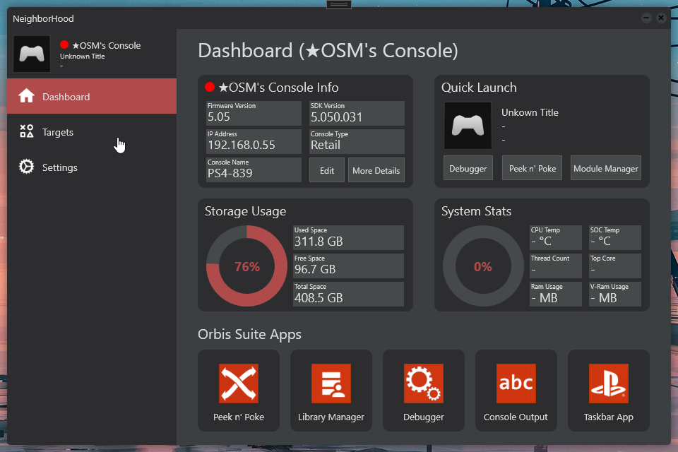
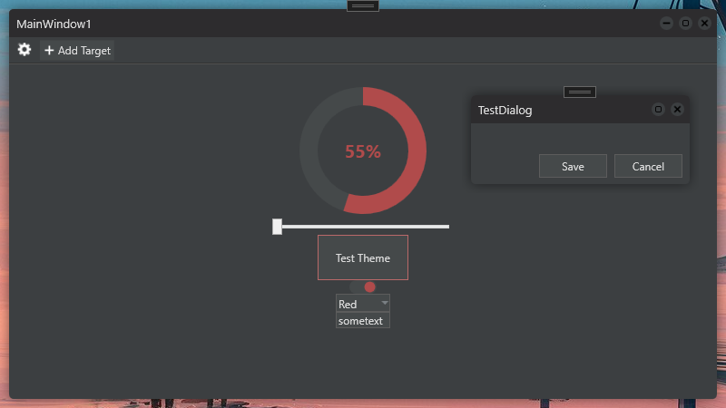
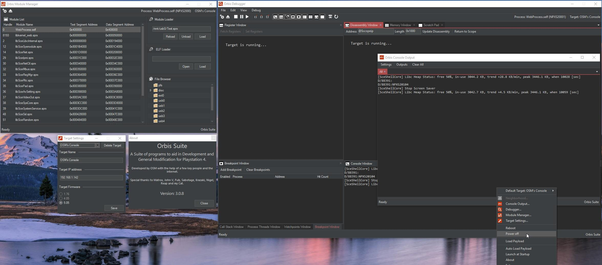

## Aether

A modern .NET 9 async wrapper for the official PS4 SDK Neighborhood API.
Paired with Aether Hub built using Avalonia, a powerful UI for managing targets, browsing installed apps, Installing/Monitoring daemons, Loading/Unloading SPRX modules, sending payloads & more!

<a href="https://github.com/AetherPS">
  <button>Learn More</button>
</a>

## Orbis Suite 3.0

The next version of Orbis Suite completely rewritten with a new UI. Now running mostly in userland on the PS4 with its own Daemon process gone is the need for a payload! Fully featured suite of tools to help aid in developing and debugging on the PS4 console. Kind of skipped a version I had worked on at the end of 2021 since I had decided to port this project to WPF from Winforms.

<a href="https://github.com/OSM-Made/Orbis-Suite">
  <button>Learn More</button>
</a>

## Simple UI

A simple UI Library to add custom themed windows and controls to a WPF project. A project I started to start teaching my self WPF.

<a href="https://github.com/OSM-Made/SimpleUI">
  <button>Learn More</button>
</a>

## Orbis Toolbox

A modification of the PlayStation 4 user interface to add jail broken features to a more user friendly experience. Leveraging Mono C# Inter-op functionality allowing seamless integration with previous work. Featuring fully custom menus, Overlays, Daemon Process Management and more.

<a href="https://github.com/OSM-Made/Orbis-Toolbox">
  <button>Learn More</button>
</a>

## Orbis Suite 1.0

A Suite of tools useful for developing home brew for a Jailbroken PlayStation 4 console. Featuring a custom API for integrating with a remote host console and Custom Debugger. Boasting many useful tools including Console Output, Debugger, Module Manager and Target Manager.

<a href="https://github.com/OSM-Made/Orbis-Suite/tree/Version-1.0">
  <button>Learn More</button>
</a>